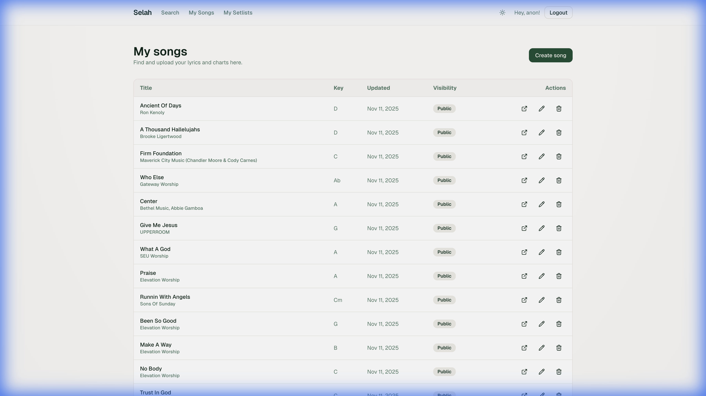
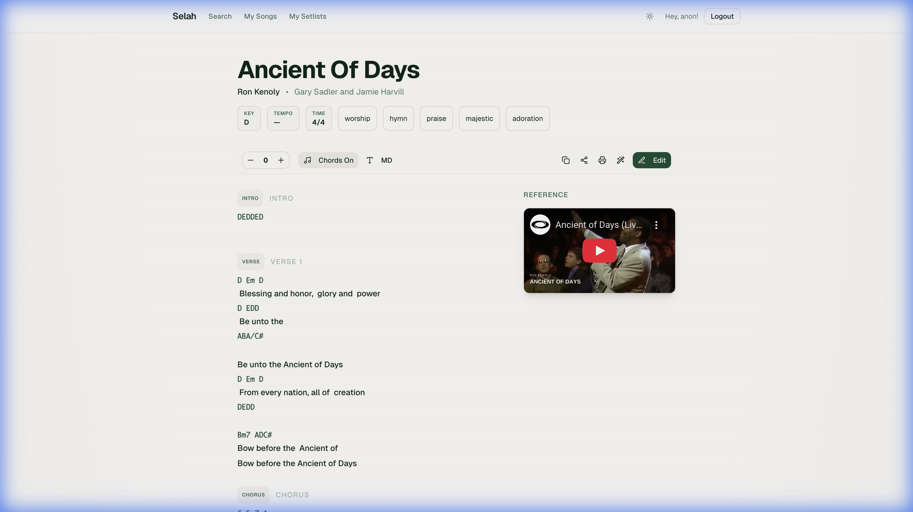
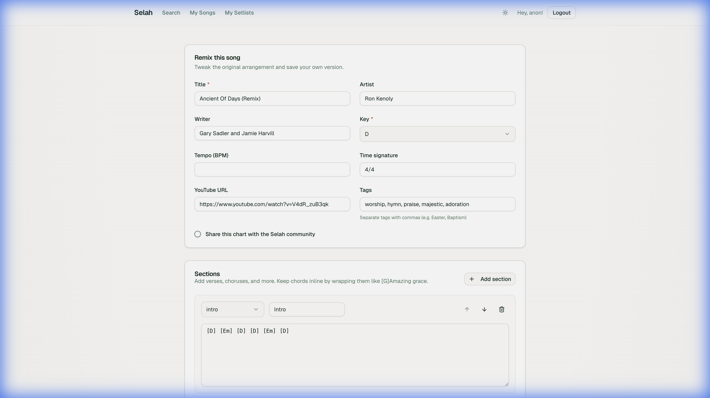

# UI/UX Deep Dive and Improvements Walkthrough

I have completed a comprehensive UI/UX deep dive and implemented a series of visual improvements to give Selah a more premium and dynamic feel.

## Changes

### 1. Visual Identity & Global Styles
- **New Color Palette:** Introduced a sophisticated HSL color palette with warmer whites, richer greens, and a golden amber accent.
- **Typography:** Updated the monospace font stack for chords to include `JetBrains Mono`, `Fira Code`, and `Monaco` for better readability.
- **Glassmorphism:** Added `.glass` and `.glass-dark` utility classes for modern, translucent UI elements.
- **Softer UI:** Increased global border radius to `0.75rem` for a friendlier aesthetic.

### 2. Landing Page Redesign
- **Hero Section:** Completely redesigned with a split layout, featuring animated text and a 3D-tilted song card preview using `framer-motion`.
- **Feature Cards:** Updated with glassmorphism effects and iconography.
- **Workflow Section:** Enhanced with a cleaner layout and better visual hierarchy.

### 3. Song Viewer Enhancements
- **Sticky Toolbar:** Controls for transposition, font size, and chords are now accessible in a sticky glassmorphic bar.
- **Typography:** Improved line height and spacing for lyrics and chords.
- **Mobile Optimization:** Better spacing and control layout for smaller screens.

### 4. Components
- **Site Header:** Now sticky with a blur effect (`backdrop-blur-xl`).
- **Song Cards:** Added hover lift effects and refined tag styling.

## Verification Results

### Automated Checks
- **Linting:** Ran `npm run lint` to ensure code quality.
- **Build:** Verified that the application builds without errors.

### Manual Verification
- **Landing Page:** Verified the new hero animation and responsive layout.
- **Public Songs:** Checked the song list layout.
- **Responsiveness:** Confirmed that the new designs adapt well to mobile breakpoints.

## Production Verification (selah.rohanrichard.com)

I performed a live walkthrough on the production environment to verify the changes in a real-world context.

### Authentication & Navigation
- **Login:** Successfully logged in using Google Sign-In.
- **Dashboard:** Verified access to "My Songs" and authenticated routes.

### Live UI Checks
- **Song Viewer:** Confirmed the sticky toolbar, typography, and controls are functioning correctly.
- **Interactions:** Tested chord toggling, font size adjustments, and transposition in the live app.

### Production Screenshots

**Dashboard (My Songs)**

**Song Viewer (Sticky Header & Controls)**

**Transposition Feature**

